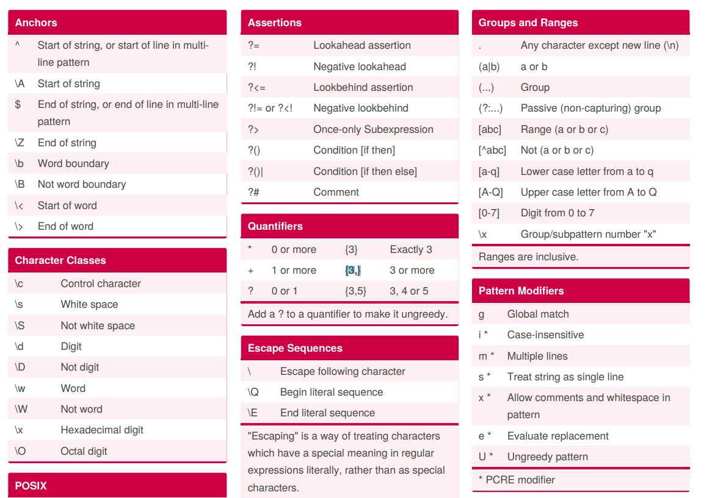

## Отладка и тестирование скриптов
### Запуск
Для удобства разработки скриптов сделал PowerShell скрипт `exc.ps1` для запуска написанного скрипта на удаленной виртуальной машине Ubuntu Server 24.04.3 LTS.

Содержимое `exc.ps1`:
```powershell
param ( [string]$Name )
plink.exe myusername@vmIpAddress -m $Name -pw 'somepassword'
```

Пример вызова скрипта для его выполнения на удаленной виртуальной машине:
```powershell
.\exc p1.sh
```

### Создать файл >=1 Мб

> dd из других ответов - хорошее решение, но для этой цели оно работает медленно. В Linux (и других системах POSIX) у нас есть fallocate, который использует желаемое пространство без необходимости что-либо записывать в него, работает с большинством современных файловых систем на основе диска, очень быстро:


```bash
fallocate -l 2M size-2M.txt
```

## Справочники

### Сделать `.tag.gz`

```bash
tar -czf result_module_2.tar.gz .
```

### Перенаправление вывода

Итак, > /dev/null 2>&1 сначала перенаправляет стандартный вывод в /dev/null, а затем перенаправляет туда же stderr. Это фактически отключает все выходные данные (обычные или ошибочные) из команды wget.

```bash
ping -W 3 -c 1 "$1" > /dev/null 2>&1
```

Данная команда с перенаправленным выводом возвращает:
* `0` - успех, хост доступен;
* `1` - ошибка (хост недоступен);
* `2` - ошибка использования (не передан хост)


### Регулярные выражения

